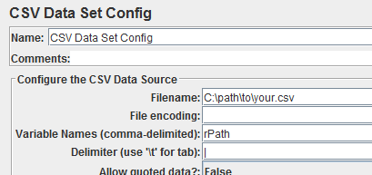

# redirects-tester
A simple Jmeter Test Plan that accepts a CSV file to check the redirection route

## Pre-requisites
 - Apache JMeter (jmeter.apache.org)
 - A CSV file containing the list of URIs(the path excluding the hostname, preceded by slash'/')

## Navigation

### Setting Your Separator for the CSV File

Since the URLs might contain commas, we use the pipe(|) delimiter instead

1. Go to your apache jmeter directory
2. Go to *bin*
3. Open *jmeter.properties* file
4. Find *jmeter.save.saveservice.default_delimiter* then set your preferred separator
5. Open the Test Plan(Redirects Testing.jmx) on JMeter
6. Navigate to Test Plan -> While Controller -> CSV Data Config
7. On *Delimiter* field, change to your preferred separator as defined on *jmeter.properties* file

### Setting up your target URL to test

1. Navigate to Test Plan -> Redirects Group -> While Controller -> HTTP Request
2. Under *Server Name or IP*, set your target hostname to test

### Setting up your source CSV File

1. Navigate to Test Plan -> While Controller -> CSV Data Set Config
2. Set the filename to your CSV source path

### Setting up your results file

1. Navigate to Test Plan -> Redirects Group -> View Results Tree
2. Under Filename field, set your preferred destination result csv file
3. You may also select the fields to be saved(response code, response message, url) by clicking the *Configure* button under *View Results Tree*

### Unfollowed Redirects
If you wish not to traverse the whole redirects route(much faster, it will just provide the target redirect url, but will not record if redirect has more than one jump), follow the procedure below:

1. Navigate to Test Plan -> Redirects Group -> While Controller -> HTTP Request
2. Uncheck *Follow Redirects*
3. Navigate to Test Plan -> Redirects Group -> Beanshell PostProcessor
4. on instantiation of *FileOutputStream* class(line 4) change the path to your target *unfollowed redirects result* location

You may now run your testplan!
